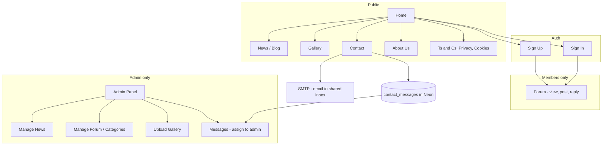

# Culcheth & Glazebury RA – Full site plan

Full site plan for the Culcheth & Glazebury Residents Association: news blog, admin panel, auth-gated forum, gallery (admin uploads), contact form with SMTP and assignable messages, and static pages (About, T&C, Privacy, Cookies). Next.js 15, Neon DB, Vercel.

---

## Architecture overview

- **Public**: Home, News (blog), Gallery, **Contact**, About, Terms & Conditions, Privacy, Cookies.
- **Authenticated users**: Forum (view categories, threads, post, reply).
- **Admins** (multiple; set `role = 'admin'` in DB for each): Admin panel – News, Forum, Gallery, **Messages**. Messages from the contact form can be assigned to a specific admin for follow-up.

---

## 0. Design system – beautiful, distinctive UI

- **Goal**: A polished, trustworthy, community-minded look that feels local and welcoming, not generic. Consistent typography, colour, and spacing across all public and admin pages.
- **Typography**: Keep **Geist** for body (already in layout). Add a strong **serif or distinctive sans** for headings (e.g. **Fraunces**, **DM Serif Display**, or **Instrument Serif** from Google Fonts) to give character. Clear hierarchy: one clear H1 per page, consistent H2/H3 sizes and weight.
- **Colour**: Define a small palette – e.g. a deep green or teal as primary (trust, community), warm neutrals for backgrounds (off-white, soft grey), and a single accent (e.g. amber or terracotta for CTAs or highlights). Use CSS variables in Tailwind/globals so all components share the same tokens. Prefer subtle borders and shadows over flat blocks.
- **Layout and spacing**: Generous whitespace; max-width container for reading (e.g. 720px for article body, 1024px for list/grid). Consistent vertical rhythm (e.g. section spacing 4–6rem). Cards with subtle borders, rounded corners, and light shadow for news, forum, and gallery.
- **Components**: Reusable **Button** (primary/secondary/ghost), **Card**, **Input**/**Textarea** (with focus states and labels), **Badge** (e.g. "New", status). Header: clear nav, optional sticky, mobile hamburger. Footer: clear link groups (About, Legal, Contact). Avoid default Tailwind blue; use the chosen primary colour for links and buttons.
- **Implementation**: Centralise tokens in `src/app/globals.css` (e.g. `--color-primary`, `--font-heading`). Use a small set of components in `src/components/ui/` so news, forum, gallery, contact, and admin share the same look. Home page: hero section with association name and short tagline; featured news or CTA; clear entry points to News, Gallery, Contact, Forum.

---

## 1. Authentication

- **Approach**: NextAuth.js v5 (Auth.js) with **Credentials** provider and session stored in a **JWT** (no DB session table required). User records live in Neon; you set `role = 'admin'` in the DB for chosen users.
- **Tables** (Neon):
  - `users`: `id` (uuid), `email` (unique), `password_hash`, `name`, `role` (`'user' | 'admin'`), `created_at`, `updated_at`.
- **Flow**: Sign up (Server Action) creates user with hashed password (e.g. `bcrypt`). Login uses Credentials provider; NextAuth checks email/password and returns JWT including `userId` and `role`. Middleware protects `/admin/*` (admin only) and `/forum/*` (authenticated only).
- **Dependencies**: `next-auth@beta` (v5), `bcryptjs` (+ `@types/bcryptjs`).
- **Files**: Auth config (e.g. `src/lib/auth.ts`), sign-up/sign-in Server Actions, `/login` and `/signup` pages, middleware in `src/middleware.ts` to check session and role.

---

## 2. News (blog)

- **Model**: Single table in Neon – e.g. `posts`: `id`, `title`, `slug` (unique), `excerpt`, `body` (text), `author_id` (FK users), `published_at`, `created_at`, `updated_at`. Optional: `cover_image_url` if you want a hero image per post.
- **Public**: List page (e.g. `/news`) – latest first, card layout (title, excerpt, date, optional image). Single post page (e.g. `/news/[slug]`) – full article.
- **Admin**: In admin panel – list posts, create, edit, delete, set `published_at` (draft vs published). Rich text for `body` can start as `<textarea>` or use a small editor (e.g. TipTap or similar) in a later phase.
- **Routes**: `src/app/news/page.tsx`, `src/app/news/[slug]/page.tsx`; admin under `src/app/admin/news/...`.

---

## 3. Forum

- **Model** (Neon):
  - `forum_categories`: `id`, `name`, `slug`, `description`, `sort_order`.
  - `forum_threads`: `id`, `category_id`, `title`, `author_id`, `created_at`, `updated_at`, `pinned` (boolean), `locked` (boolean).
  - `forum_posts`: `id`, `thread_id`, `author_id`, `body` (text), `created_at`, `updated_at`.
- **Public**: No. Only logged-in users see Forum in nav and can access it.
- **Behaviour**: Categories list → threads in category → thread view with replies. Users create threads and reply; admins can pin/lock threads and delete posts (from admin panel or inline with role check).
- **Routes**: `src/app/forum/page.tsx` (categories), `src/app/forum/[categorySlug]/page.tsx` (threads), `src/app/forum/[categorySlug]/[threadId]/page.tsx` (thread + replies). Forms via Server Actions (create thread, create reply). Optional: `src/app/admin/forum/` for category CRUD and moderation.

---

## 4. Gallery

- **Model**: Admin-only uploads. Option A – flat: `gallery_images`: `id`, `url` (storage URL), `caption`, `uploaded_at`, optional `sort_order`. Option B – albums: `gallery_albums` + `gallery_images` with `album_id`. Start simple with a single list (Option A); add albums later if needed.
- **Storage**: **Vercel Blob** – fits Vercel deploy, no extra credentials for S3. Upload from admin panel (Server Action) → store file in Blob → save `url` (and caption) in Neon.
- **Public**: Single gallery page (e.g. `/gallery`) – grid of images with optional lightbox; captions and date.
- **Admin**: Page under `/admin/gallery`: upload one or more images, set caption; list/delete existing.
- **Dependencies**: `@vercel/blob`.
- **Routes**: `src/app/gallery/page.tsx`; `src/app/admin/gallery/page.tsx`.

---

## 5. Contact form, SMTP, and message system

- **Contact page (public)**: A `/contact` page with a form: name, email, subject, message. On submit, two things happen:
  1. **Email via SMTP**: The message is sent to the shared inbox so the team receives it in their normal email client (Proton Mail).
  2. **Message record in DB**: The same submission is stored in Neon so admins can triage and assign it inside the admin panel.
- **Shared inbox: Proton Mail**. The single address used for contact form delivery is a **Proton Mail** address. Any SMTP sending provider (Resend, SendGrid, Mailgun, etc.) can deliver to Proton; the "to" address is configured in the admin panel.
- **SMTP configured in admin panel**. Admins set SMTP and inbox from the admin UI instead of env vars. Stored in DB in a single-row table; the app reads this when sending contact form emails.
  - **Admin page**: e.g. `/admin/settings` or `/admin/email` with a form: SMTP host, port, user, password, "from" address, and **contact inbox** (Proton Mail address that receives contact form emails). Optional "Test" button to send a probe email.
  - **Storage**: Table `smtp_config` (single row): `id`, `host`, `port`, `user`, `password_encrypted` (encrypt at rest using a secret from env), `from_address`, `contact_inbox`, `updated_at`. Only one row; admin form updates it. Use an env var `ENCRYPTION_KEY` (or `SMTP_ENCRYPTION_KEY`) to encrypt/decrypt the password when saving/loading.
  - **Sending**: `src/lib/email.ts` loads SMTP config from DB (decrypt password), builds Nodemailer transport. Two send flows: (1) contact form → send to `contact_inbox`; (2) assignment notification → send to the assigned admin's email (from `users.email`). If no config is set or send fails, still save the submission to `contact_messages` and optionally surface an admin warning.
- **Assignment notification**: When an admin assigns a contact message to another admin (e.g. from the Messages list or detail page), the **assign** action must trigger an email from the site to that assigned admin's email address. Email content: e.g. "You have been assigned a contact message: [subject]" and a link to view it in the admin panel (e.g. `/admin/messages/[id]`). Use the same SMTP config from the admin panel; recipient = assigned user's `email` from the `users` table.
- **Table** (Neon): `contact_messages`: `id` (uuid), `name`, `email`, `subject`, `body` (text), `created_at`, `assigned_to_id` (FK `users.id`, nullable), `status` (e.g. `'new' | 'in_progress' | 'done'`).
- **Admin message system**: **Messages** (e.g. `/admin/messages`). List contact submissions; assign to admin (dropdown); set status. When "assign" is saved, update `assigned_to_id` and call the notification email helper so the assigned admin receives the email. See section 6.
- **Dependencies**: `nodemailer` (+ `@types/nodemailer`). For encryption: Node `crypto` (e.g. AES-256-GCM) with `ENCRYPTION_KEY` from env.
- **Files**: `src/app/contact/page.tsx` (form + Server Action), `src/lib/email.ts` (load config from DB, build transport, send), `src/app/admin/settings/page.tsx` or `src/app/admin/email/page.tsx` (SMTP + contact inbox form, optional test), `src/app/admin/messages/page.tsx`.

---

## 6. Admin panel

- **Access**: Route group or path prefix `/admin`. Middleware: if not authenticated or `role !== 'admin'` → redirect to home or login. **Multiple admins** supported: any user with `role = 'admin'` in the DB has full admin access; add admins by setting `role` when creating/editing users (e.g. via SQL or a future "manage users" screen).
- **Layout**: Shared admin layout (sidebar or top nav) with links: Dashboard, **Messages**, News, Forum (categories + moderation), Gallery, **Settings** (or **Email**).
- **Settings / Email**: Admin-only page where SMTP and the Proton Mail inbox are configured (see section 5). Form: SMTP host, port, user, password, from address, contact inbox (Proton). Optional "Send test email" to verify. No SMTP credentials in env; only `ENCRYPTION_KEY` in env for encrypting the stored password.
- **Dashboard**: Summary cards or links: unread/new message count, recent news, latest forum activity, gallery count. Quick link to Messages and to Settings if SMTP is not yet configured.
- **Files**: `src/app/admin/layout.tsx`, `src/app/admin/page.tsx`, `src/app/admin/settings/page.tsx` (or `email/page.tsx`) for SMTP + contact inbox, `src/app/admin/messages/page.tsx`, `src/app/admin/news/...`, `src/app/admin/forum/...`, `src/app/admin/gallery/page.tsx`.

---

## 7. Static / legal and About pages

- **Pages**: About Us, Terms & Conditions, Privacy Policy, Cookie Policy. No auth required; linked from footer (and optionally header).
- **Content**: Implement as normal Next.js pages with content in the component (or in `.md`/MDX if you prefer). Keeps legal text in code and easy to review; you can later move to DB if admins need to edit.
- **Routes**: `src/app/about/page.tsx`, `src/app/terms/page.tsx`, `src/app/privacy/page.tsx`, `src/app/cookies/page.tsx`. Use a shared layout or component for consistent typography and styling.

---

## 8. Shared UI and navigation

- **Layout**: Reuse or extend `src/app/layout.tsx` with a global header and footer. Apply the design system (section 0) so the site feels cohesive and beautiful.
- **Header**: Logo/site name (link to `/`), nav links: Home, News, Gallery, **Contact**, About; if not logged in: Sign In, Sign Up; if logged in: Forum, Sign Out; if admin: Admin.
- **Footer**: About, Terms & Conditions, Privacy Policy, Cookie Policy; **Contact**; optional social links.
- **Components**: Put reusable pieces (e.g. `Header`, `Footer`, `Button`, `Card`, form inputs) under `src/components/` and `src/components/ui/` so news, forum, gallery, contact, and admin share the same look.

---

## 9. Database and migrations

- **Neon**: Single Postgres project. Create tables via SQL (migration scripts or run manually in Neon SQL editor). No ORM required; keep using `src/lib/db.ts` with `getSql()` and raw SQL or a small query helper.
- **Order**: Create `users` first (auth), then `posts`, then `forum_*`, then `gallery_images`, then `contact_messages`, then `smtp_config` (single row: host, port, user, password_encrypted, from_address, contact_inbox, updated_at). Provide one or more `.sql` files in repo (e.g. `scripts/schema.sql`) so you can run them once per environment.

---

## 10. Environment and deployment

- **Env vars**:
  - **Neon**: `DATABASE_URL`
  - **Auth**: `NEXTAUTH_SECRET`, `NEXTAUTH_URL` (e.g. `https://your-domain.vercel.app` in prod)
  - **Vercel Blob**: `BLOB_READ_WRITE_TOKEN` (set when Blob is enabled in the Vercel project)
  - **SMTP (admin-configured)**: `ENCRYPTION_KEY` – used to encrypt/decrypt the SMTP password stored in the `smtp_config` table. No SMTP credentials in env; admins set host, port, user, password, from, and Proton Mail inbox in the admin panel.
- **Vercel**: Deploy as-is; add env vars in Project Settings. Blob is available once enabled.

---

## 11. Suggested implementation order

1. **Design system** – CSS variables, typography (heading font), palette, base components (Button, Card, inputs) in `globals.css` and `src/components/ui/`.
2. **DB schema** – Create and run `users`, `posts`, `forum_*`, `gallery_images`, `contact_messages` in Neon.
3. **Auth** – NextAuth setup, sign up / sign in, middleware for protected routes and admin.
4. **Layout and nav** – Header/footer with Contact link, design-system styling, conditional Forum/Admin.
5. **Home** – Hero and entry points (News, Gallery, Contact, Forum) using the new design.
6. **Contact + SMTP + Messages** – Contact page form; `smtp_config` table and admin **Settings/Email** page (SMTP + Proton inbox, password encrypted); `src/lib/email.ts` (load config from DB, Nodemailer, send to contact inbox); Server Action (send email + insert `contact_messages`); admin Messages list and assign-to-admin.
7. **News** – Public list + single post; admin CRUD for posts.
8. **Static pages** – About, Terms, Privacy, Cookies (content in components).
9. **Forum** – Categories, threads, replies; Server Actions; optional admin category/moderation.
10. **Gallery** – Vercel Blob + Neon; public grid; admin upload/delete.
11. **Admin panel** – Dashboard (including message count), wire Messages, News, Forum, Gallery; pin/lock threads, delete posts as needed.

---

## Key files (summary)

| Area           | Path / purpose |
| -------------- | -------------------------------------------------------------------------------------------------------------------------------------- |
| Design         | `src/app/globals.css` (tokens), `src/components/ui/` (Button, Card, inputs)                                                            |
| Auth           | `src/lib/auth.ts`, `src/app/login/page.tsx`, `src/app/signup/page.tsx`, `src/app/api/auth/[...nextauth]/route.ts`, `src/middleware.ts` |
| DB             | `scripts/schema.sql` (include `contact_messages`, `smtp_config`), keep `src/lib/db.ts`                                                 |
| Layout         | `src/components/Header.tsx`, `src/components/Footer.tsx`, update `src/app/layout.tsx`                                                  |
| Contact        | `src/app/contact/page.tsx`, `src/lib/email.ts` (load SMTP from DB, send via Nodemailer), Server Action (submit → email + DB)           |
| Settings/Email | `src/app/admin/settings/page.tsx` – SMTP + Proton inbox form; `smtp_config` table; password stored encrypted       |
| Messages       | `src/app/admin/messages/page.tsx` (list, assign to admin, status); optional `[id]` for detail                                          |
| News           | `src/app/news/page.tsx`, `src/app/news/[slug]/page.tsx`, `src/app/admin/news/...`                                                      |
| Forum          | `src/app/forum/` (categories, threads, thread detail), Server Actions                                                                  |
| Gallery        | `src/app/gallery/page.tsx`, `src/app/admin/gallery/page.tsx`                                                                           |
| Admin          | `src/app/admin/layout.tsx`, `src/app/admin/page.tsx`, nav includes Messages and Settings (Email)                                       |
| Static         | `src/app/about/page.tsx`, `src/app/terms/page.tsx`, `src/app/privacy/page.tsx`, `src/app/cookies/page.tsx`                             |

This keeps the stack as requested: Next.js 15, Neon, Vercel, with TypeScript throughout; SMTP and Proton Mail inbox configured in the admin panel (stored in DB, password encrypted); an assignable message system for admins; and a clear, beautiful design system applied across the site.
